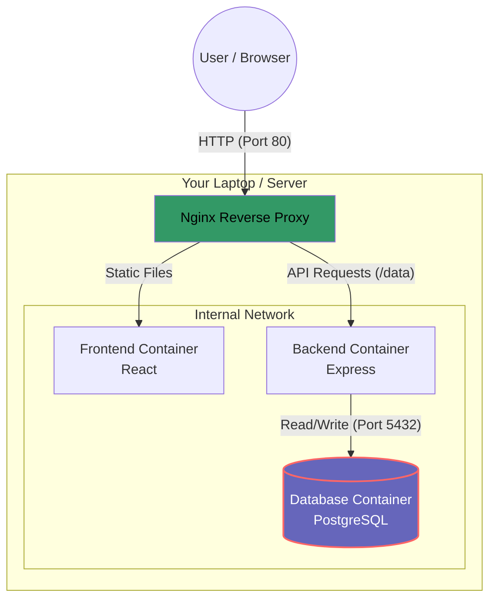

# Event Registration System


The Event Registration System is an application to manage event's attendees.
- **User page** : User register to the event
- **Admin page** : Admin view and delete participants.

The system is fully containerized using **Docker** and uses **Nginx** as a reverse proxy for a production-ready architecture.

## Tech Stack
* **Frontend:** React.js
* **Database:** PostgreSQL
* **DevOps:** Docker, Docker Compose, Nginx, GitHub Actions

## Architecture


## Getting Started
### Prerequisites:
- Docker &  Docker Compose installed
### Installation:
1. **Clone the repository**
```bash
git clone https://github.com/jarbbie/event-registration-system.git;
cd event-registration-system;
```
2. **Create Environment Variables** Create `.env` file in root directory:

**.env example:**
```Properties
POSTGRES_USER=postgres
POSTGRES_PASSWORD=password123
POSTGRES_DB=my_app
FRONTEND_PORT=3000
BACKEND_PORT=8000
DATABASE_PORT=5432
```

3. **Run with Docker**
```bash
docker compose up --build
```

4. **Access the App**
Open your browser and visit: http://localhost

## API Endpoints
The backend is accessible via Nginx at /data.

|Method|Endpoint|Description
|---|---|---
|GET|`/data`|Retrieve all attendees
|POST|`/data`|Register a new attendee
|DELETE|`/data/:id`|Remove an attendee

## Contributing

1. **Fork the Project**

2. **Create your Feature Branch**
```bash
git checkout -b feat/Feature
```

3. **Commit your Changes**
```bash
git commit -m 'feat: Add some Feature'
```

4. **Push to the Branch**
```bash
git push origin feat/Feature
```

5. **Open a Pull Request**